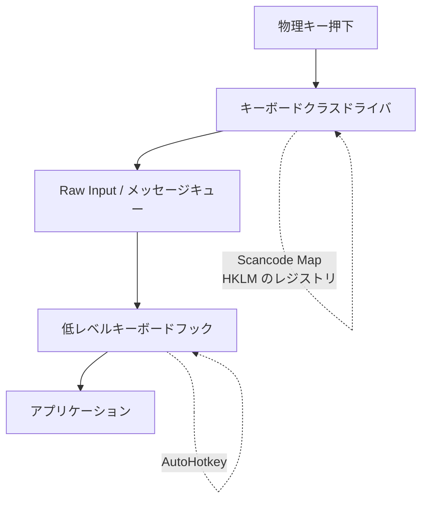

# 概要

Windows で Mac のキーボードを模した操作性を実現する。

キー配置の変更は **Scancode Map**（レジストリ）、修飾キーを伴う組み合わせは **AutoHotkey** が担当する。

# 仕組み

キー入力は下図の順に処理される。Scancode Map はカーネル層で働くため、AutoHotkey には**変換後のキーが届く**。



この層の違いが、そのまま役割分担になっている。

| | Scancode Map | AutoHotkey |
|---|---|---|
| 層 | カーネル（ドライバ） | ユーザーモード（フック） |
| 適用範囲 | ログイン画面・UAC・管理者権限アプリを含む全て | ログイン後の自分のセッションのみ |
| 反映 | 再起動が必要 | 即時 |
| できること | 1:1 のキー置換のみ | 修飾キー付きの組み合わせ |

# Scancode Map

`scancode_map.ps1` を管理者権限で実行し、**再起動**すると反映される。`setup.ps1` から呼ばれる。

| 元のキー | 変更後 | 目的 |
|---|---|---|
| CapsLock | 右 Ctrl | Mac の Control と同じ位置なので Ctrl として扱う |
| 左 Ctrl | 左 Win | 左下 3 キーを Mac の並びへ |
| 左 Win | 左 Alt | 同上 |
| 左 Alt | 左 Ctrl | 同上 |
| 無変換 | 半角/全角 | |
| 変換 | 半角/全角 | |

左右の Ctrl を分けているのが要点である。左 Ctrl（物理 Alt）は Mac の ⌘ と同じ位置で
コピー & ペーストを担い、右 Ctrl（物理 CapsLock）は Mac の Control として
AutoHotkey のカーソル移動を担う。アプリからはどちらも `Ctrl` に見えるが、
AutoHotkey はフック層で左右を判別できる。

# AutoHotkey

`move_cursor_like_ecmas.ahk` が Emacs 風のカーソル移動を提供する。

| 打鍵（物理キー） | スクリプトの記述 | 動作 |
|---|---|---|
| CapsLock + f / b | `>^f` / `>^b` | → / ← |
| CapsLock + p / n | `>^p` / `>^n` | ↑ / ↓ |
| CapsLock + a / e | `>^a` / `>^e` | Home / End |
| CapsLock + w | `>^w` | Home |
| CapsLock + d / h | `>^d` / `>^h` | Delete / BackSpace |

キーに刻印された名前とキーコードが食い違う点に注意する。Scancode Map によって、
物理キー `CapsLock` が押されるとシステムには右 Ctrl が届く。`>^` は右 Ctrl だけを
指す記法なので、コピー & ペーストに使う左 Ctrl（物理 Alt）には影響しない。

ここで割り当てていないキーは素通しされる。`CapsLock + g` が Ctrl+G として herdr の
prefix に届くのはそのためで、macOS の Control が f/b/p/n などだけ OS に横取りされ、
残りがアプリへ渡るのと同じ構造になっている。

ターミナルは `#IfWinNotActive` で除外している。shell 自身が Ctrl のキーバインドを
持っているためで、macOS でも Cocoa のカーソル移動はターミナルには効かない。

## コメントは ASCII で書く

AutoHotkey v1 は BOM の無いファイルを ANSI として読む。日本語コメントの UTF-8
バイト列が誤解釈され、**直後の 1 行が無言で消える**。コメントの下に置いたホットキーが
登録されず、原因の分かりにくい不具合になる。

## スタートアップへの登録

スクリプトは**スタートアップフォルダへコピーする**。`setup.ps1` がこれを行う。

```
cp .windows/keyboard_manager/move_cursor_like_ecmas.ahk \
  "/mnt/c/Users/<user>/AppData/Roaming/Microsoft/Windows/Start Menu/Programs/Startup/"
```

WSL 上のパス（`\\wsl.localhost\...`）を symlink やショートカットで参照してはいけない。
ログオン直後は WSL が起動しておらずパスを解決できないため、AutoHotkey は起動のたびに
スクリプトを読めずに終了する。

リポジトリを編集したら上記のコピーをやり直し、AutoHotkey を再起動する。

# 経緯

当初は PowerToys Keyboard Manager と ChangeKey を併用していたが、Scancode Map に一本化した。

PowerToys と AutoHotkey はどちらも低レベルキーボードフックを使うため同じ層に同居する。フックチェーンの順序が不定なうえ、片方がキーを飲み込むともう片方がキーを離したイベントを受け取れず、`CapsLock` が押しっぱなしになることがあった。キー置換をカーネル層へ移したことで、この競合は原理的に起きなくなった。

Scancode Map は ChangeKey が行うレジストリ変更と同じ仕組みのため、ChangeKey も不要になった。

なお PowerToys 本体は FancyZones などで引き続き使用している。**Keyboard Manager モジュールのみ無効化**しておくと、常駐プロセスが減りフック層での競合の芽も消える。

# 参考

- [Keyboard and mouse class drivers](https://learn.microsoft.com/ja-jp/windows-hardware/drivers/hid/keyboard-and-mouse-class-drivers)
  > Scancode Map レジストリ値は、キーボード クラス ドライバーによって読み取られます
- [About Keyboard Input](https://learn.microsoft.com/ja-jp/windows/win32/inputdev/about-keyboard-input)
  > スキャン コードは、キーボード ドライバーによって仮想キー コードに変換されます

# キーボードの入力速度設定

1 打目から 2 打目の間隔を短くする。

コントロールパネル → キーボード → 表示までの待ち時間
