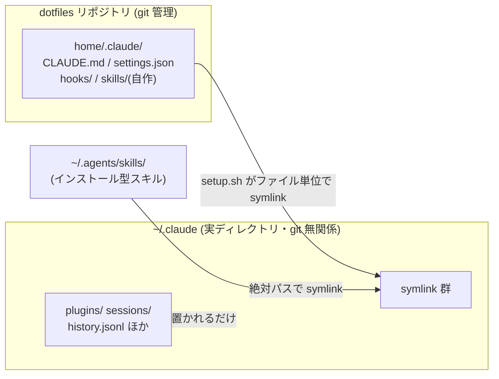

# Claude Code 設定の管理方針(dotfiles との棲み分け)

## TL;DR

- `~/.claude` は**実ディレクトリ**。dotfiles で管理するファイルだけを `home/.claude/` から**ファイル単位で symlink** する(ディレクトリ丸ごとリンクしない)
- インストール由来のスキル・プラグイン・ランタイム状態は実ディレクトリに直接置かれるだけなので、**構造的に git 差分が出ない**
- 会社起因のプラグインは**使うリポジトリごとに** `claude plugin enable --scope local` で有効化する

## 全体構造



## 管理の分類

| 種類 | 実体の場所 | git 管理 |
|------|-----------|---------|
| 共通設定(CLAUDE.md, settings.json, hooks) | `home/.claude/` → symlink | ✅ dotfiles |
| 自作スキル(commit, create-doc) | `home/.claude/skills/` → symlink | ✅ dotfiles |
| インストール型スキル | `~/.agents/skills/` → symlink | ❌ |
| 会社プラグイン | `~/.claude/plugins/`(本体)+ 各リポジトリの `.claude/settings.local.json`(有効化) | ❌ |
| ランタイム状態(history, sessions, cache) | `~/.claude/` 直下 | ❌ |

## 仕組み: setup.sh の symlink

`setup.sh` の `symboliclink_dotfiles` は2段構えでリンクを張る。

1. `bulk_symlink_target` に列挙されたディレクトリは**丸ごと1本の symlink**(`.aliases` など)
2. それ以外の `home/` 配下の全ファイルは find で**1ファイルずつ symlink**

`.claude` は意図的に `bulk_symlink_target` から**外してある**。丸ごとリンクすると `~/.claude` がリポジトリの作業ツリーそのものになり、スキルインストーラーや Claude Code 自身が書き込むファイルがすべて git に現れてしまうため。ファイル単位方式なら `~/.claude` は実ディレクトリとして作られ、管理対象のファイルだけがリンクになる。

**`.claude` を bulk リストに戻してはいけない。**

## スキルの運用

### 自作スキルを追加する

```bash
mkdir -p ~/.ghq/github.com/ktanoooo/dotfiles/home/.claude/skills/<skill-name>
# SKILL.md を書く
cd ~/.ghq/github.com/ktanoooo/dotfiles && ./setup.sh symboliclink_dotfiles
```

symlink が張られた時点で全プロジェクトから使える。コミットすれば他マシンにも展開される。

### インストール型スキル

インストーラーが `~/.agents/skills/` などに実体を置き、`~/.claude/skills/` に symlink を張る。git には一切現れないので何も気にしなくてよい。

symlink が**相対パス**で張られている場合は注意。`~/.claude` の位置が変わるとリンク切れになるため、絶対パスで張り直す:

```bash
ln -sfn ~/.agents/skills/<skill-name> ~/.claude/skills/<skill-name>
```

## プラグインの運用

### スコープと書き込み先

| スコープ | 書き込み先 | git |
|---------|-----------|-----|
| `user`(デフォルト) | `~/.claude/settings.json` = **tracked** | 差分が出る |
| `local` | 実行時のリポジトリの `.claude/settings.local.json` | 出ない |

### 使い分け

- **全マシン共通で使いたい & 公開されて問題ない** → user スコープのまま。差分が出るのは正常なので**コミットする**(dotfiles 管理そのもの)
- **会社起因・このマシン限定** → 使うリポジトリごとに local スコープで有効化:

```bash
cd <リポジトリ>
claude plugin enable --scope local <plugin>@<marketplace>
```

新しい marketplace を会社用途で追加する場合もスコープを明示する:

```bash
claude plugin marketplace add <source> --scope local
```

反映されない場合はセッションを開き直すか `/reload-plugins` を実行する。

## 落とし穴

### `~/.claude/settings.local.json` はユーザーレベルでは効かない

`.claude/settings.local.json` は**プロジェクトスコープ専用**。ホームディレクトリに置いても「`~` をプロジェクトとして claude を開いたとき」しか読まれない。「マシン全体で有効・かつ git 管理外」というスコープは存在しないため、その用途はリポジトリごとの local スコープで代替する。

### `/plugin marketplace add` はデフォルトで tracked ファイルに書く

スコープ未指定だと `~/.claude/settings.json` に `extraKnownMarketplaces` が追記され差分が出る。会社用途なら `--scope local` を付ける。誤って書かれた場合は `git checkout -- home/.claude/settings.json` で戻してよい(marketplace の登録自体は `~/.claude/plugins/` 側に残る)。

### setup.sh は古いリンクを掃除しない

リポジトリからファイルを削除しても、セットアップ済みマシンにはそのファイルを指す dangling symlink が残る。リポジトリの構造変更(ディレクトリのリネーム等)の後は、ターゲットを絞らず `./setup.sh` を**引数なしで全実行**し(冪等なので数秒で終わる)、リンク切れを検出して手で消す:

```bash
find ~ -maxdepth 1 -type l ! -exec test -e {} \; -print
find ~/.config ~/.claude "$HOME/Library/Application Support/Code/User" \
  -maxdepth 3 -type l ! -exec test -e {} \; -print
```

### グローバル gitignore の `/.claude/*` ブロックは消さない

`home/.gitignore` は `~/.gitignore` として**全リポジトリに効くグローバル gitignore**。`/.claude/*` + 個別 whitelist のブロックは、各プロジェクトの `.claude/` 配下のランタイムファイル(settings.local.json 等)を ignore する役割を持つ。dotfiles リポジトリだけの都合で削除しないこと。

## 参考資料

**参考**: [Claude Code settings](https://code.claude.com/docs/en/settings)

> Local (`.claude/settings.local.json`) — project-scoped, gitignored
>
> (訳)Local(`.claude/settings.local.json`)— プロジェクトスコープ、gitignore 対象

**参考**: [Plugins reference](https://code.claude.com/docs/en/plugins-reference)

> enabledPlugins still honors project and local settings.
>
> (訳)enabledPlugins はプロジェクト設定・ローカル設定でも有効。

**参考**: [Agent Skills](https://code.claude.com/docs/en/skills)

> The bare `/fancy` also works unless another command uses that name (v2.1.216+)
>
> (訳)他のコマンドと名前が衝突しない限り、プラグイン名なしの `/fancy` でも呼び出せる(v2.1.216以降)。スラッシュメニューの補完はプレフィックス一致。

<!-- AI Agent Context
作成日: 2026-08-10
目的: ~/.claude を実ディレクトリ化しファイル単位 symlink に移行した際の運用ルールを、今後見返せる形で固定するため
参照: https://code.claude.com/docs/en/settings, https://code.claude.com/docs/en/plugins-reference, https://code.claude.com/docs/en/skills
注意: setup.sh の bulk_symlink_target に .claude が入っていないことが前提。setup.sh の symlink 方式を変えた場合はこのドキュメントも更新すること。プラグインのスコープ仕様は Claude Code 本体のバージョンアップで変わりうる。固有のプラグイン名・社名は書かないこと(公開リポジトリのため)
-->
