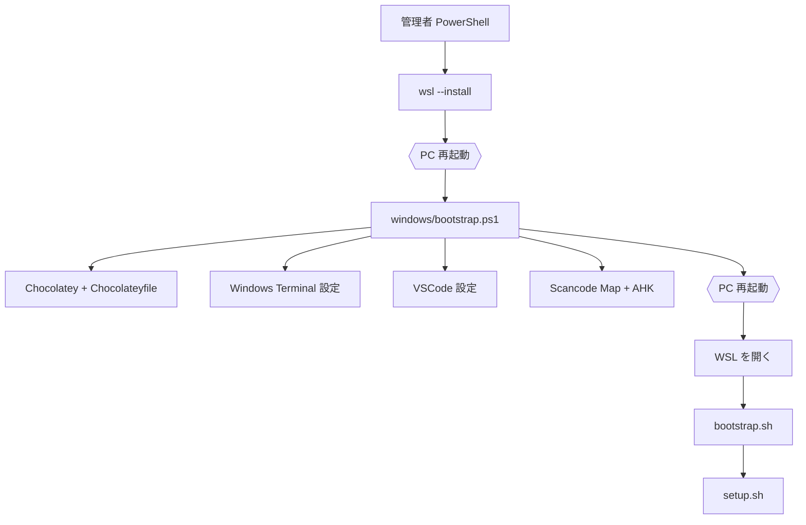
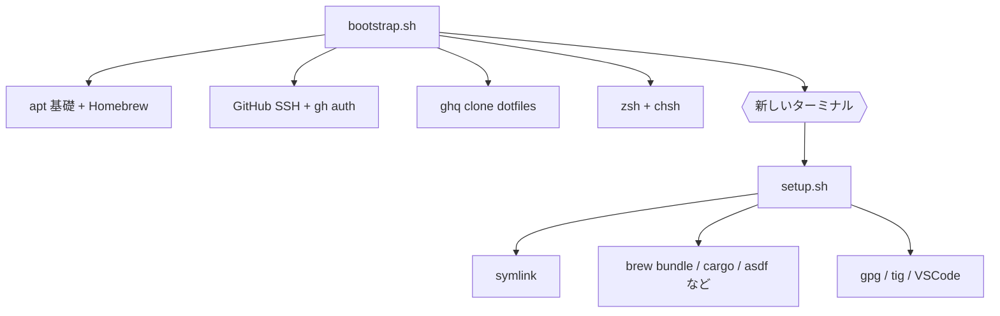
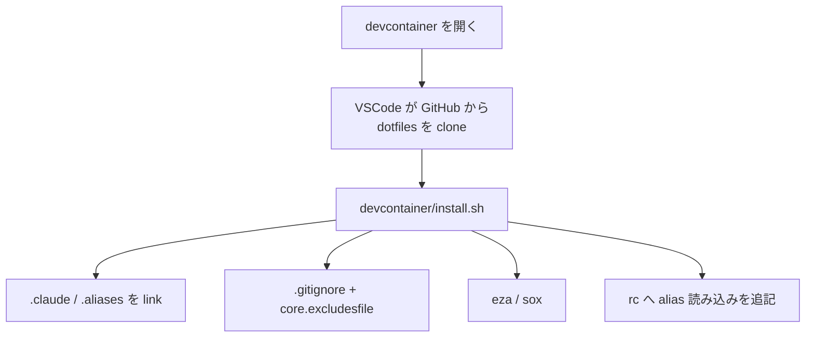

# セットアップ設計

新規マシンの構築と、既存マシンの再適用をどう行うかの設計。

## 構成

スクリプトは 3 つ。`devcontainer/install.sh` は devcontainer 機能から独立して呼ばれるため別枠。

| スクリプト | 対象 | 性質 |
|---|---|---|
| `bootstrap.sh` | WSL / Mac | 1 回きり。リポジトリが無い状態から始める。対話あり |
| `setup.sh` | WSL / Mac | 何度でも。冪等・選択実行 |
| `windows/bootstrap.ps1` | Windows | PowerShell。clone 前に単体で走る |

```
dotfiles/
├── README.md              入口。OS ごとの手順のみ
├── bootstrap.sh
├── setup.sh
├── home/                  ~ へリンクされるもの
├── packages/              パッケージ一覧のデータ
│   ├── Brewfile.darwin
│   ├── Brewfile.linux     linuxbrew 用
│   ├── Chocolateyfile
│   ├── Cargofile
│   ├── VSCodefile
│   └── README.md          自動化できないもの（Chrome 拡張など）
├── windows/               Windows 専用
│   ├── bootstrap.ps1
│   └── keyboard_manager/
├── vscode/
├── devcontainer/
└── docs/
```

`home/` と `packages/` の分離が構成の要点である。`home/` は `$HOME` へリンクされる
設定そのもの、`packages/` は宣言的なリストで、スクリプトはそれを読んで流すだけにする。

## 実行順序

### Windows



`windows/bootstrap.ps1` は clone より前に走るため、必要なファイルを全て
GitHub から取得する。ディスク上のリポジトリを前提にできない。

### WSL / Mac



Mac に PC 再起動の境界は無い。

### devcontainer

`devcontainer/install.sh` だけは呼び出し元が VSCode 側にある。`vscode/settings.json`
のこの 2 行が入口で、README にも `setup.sh` にも現れない。

```json
"dotfiles.repository": "ktanoooo/dotfiles",
"dotfiles.installCommand": "devcontainer/install.sh",
```



どのプロジェクトで開いても走るため、内容は意図的に最小限にとどめる。Homebrew・asdf・
rust・gpg・`chsh` まで見る `setup.sh` は、使い捨てのコンテナには重すぎるうえ不要。

**clone 元は GitHub のデフォルトブランチ**であり、手元の作業ツリーではない。
ディレクトリ構成を変えたら push するまでコンテナ側は旧構造を取りに行く。
部分的に push した状態を作らない。

## 設計方針

### 1. 人間の介在が必要な地点だけを段階の境界にする

境界は 3 つだけ。それ以外は自動で連続実行する。

| 境界 | 理由 |
|---|---|
| Windows 再起動 | `wsl --install` の反映 |
| Windows 再起動 | Scancode Map はドライバ層のため |
| ブラウザ認証 | `gh auth login --web` |

**WSL 内に再起動は不要**。`chsh` でログインシェルが変わるが、新しいターミナルを
開けば足りる。

### 2. 全処理を冪等にする

「済んでいれば飛ばす」ガードを付ける。全部流しても導入済みの環境では数秒で終わる
ため、コメントアウトによる選別が不要になる。かつてスクリプトが手で編集されながら
運用されていたのは、再実行が安全でなかったことへの回避策だった。

`brew upgrade` を `setup.sh` に含めないのも同じ理由による。アップグレードは
セットアップとは別の関心事で、これが全体の実行時間を押し上げていた。

### 3. 選択実行を用意する

```
./setup.sh                       # 全部
./setup.sh setup_gpg install_herdr   # 指定したものだけ
./setup.sh --list                # 対象一覧
```

対象はコマンドラインでの並び順によらず、宣言された順に実行する。依存
（リンク → リンク先を読む処理、rust → cargo、brew → brew で入るもの）が保たれる。

### 4. スクリプトは薄く、パッケージ一覧はデータに寄せる

`Brewfile` `Cargofile` `Chocolateyfile` `VSCodefile` は宣言的なリスト。

### 5. `exec` を実行の途中に置かない

プロセスが置換されて以降が実行されない。シェルの再読み込みが必要な場合は、
最後にメッセージで指示する。

## OS 固有のものの置き場所

Windows だけディレクトリごと分かれているのは、**PowerShell という別のツールチェーン
が必要**なため。Mac は同じ Unix / bash なので `$OSTYPE` 分岐で足りる。この非対称は
意図的なもの。

Mac 固有は集約せず散在させたままにするが、**パスの解決方法は統一する**。

| Mac 固有 | 場所 |
|---|---|
| パッケージ一覧 | `packages/Brewfile.darwin` |
| pinentry | `home/.gnupg/gpg-agent.conf.mac` |
| Android SDK / JDK / ssh-add | `home/.zshrc` の分岐 |
| tig の diff-highlight | `setup.sh` の分岐 |
| `osxkeychain` | `home/.gitconfig.darwin` |

Homebrew のパスは `$(brew --prefix)` で解決する。Intel は `/usr/local`、
Apple Silicon は `/opt/homebrew` で、直書きすると片方で存在しないパスになる。

## 順序に依存する制約

`$HOME` の設定は `setup.sh` がリンクして初めて存在する。**それより前に走る処理は
自分の設定を当てにできない**。

### ghq の root

`ghq.root` は `home/.gitconfig` にあるが、`bootstrap.sh` の `ghq get` はリンク前に
走る。放置すると ghq は既定値の `~/ghq` へ clone し、以後 `ghq list` も `ghq root`
も `~/.ghq` を見るため、clone は誰からも参照されない。`bootstrap.sh` で `GHQ_ROOT`
を export して解決する。値は `home/.gitconfig` の `[ghq] root` と同期させる。

### .gitconfig の OS 分岐

`includeIf` は gitdir・onbranch・hasconfig を条件にできるが、**OS は条件にできない**。
そのため `home/.gitconfig` は `~/.gitconfig.os` を固定パスで include し、実体を
どちらに向けるかは `setup.sh` の `setup_gitconfig` が決める。

### ~/.gitignore は単体では効かない

git が既定で読む除外ファイルは `~/.config/git/ignore` であり、`~/.gitignore` は
`core.excludesfile` で明示しない限り読まれない。通常のマシンではリンクされた
`.gitconfig` がこれを設定しているが、`.gitconfig` を張らない環境
（devcontainer）では、リンクを張るだけでは無視設定が効かないままになる。

### setup.sh は clone から実行する

`BASH_SOURCE` を基準にパスを解決するため、`curl | bash` では動かない。
`bootstrap.sh` は自己完結しているので curl 実行してよい。

### symlink はファイル単位で張る

ディレクトリごとリンクすると、設定の隣に置かれた実行時の状態
（`~/.claude` 配下のキャッシュなど）の行き先が変わる。`setup.sh` は
`home/` を走査して 1 ファイルずつ張る。意図的にディレクトリごと張るものだけ
`bulk_symlink_target` に列挙する。

## 運用

### 再適用

```
./setup.sh
```

### パス構成を変えたとき

`home/` や `packages/` を改名すると、`$HOME` の symlink は旧パスを指したままになる。
この状態で `setup.sh` を実行しても、**参照先が変わらないまま `ln -sfn` が走って
壊れたリンクが再生産されるだけ**で直らない。`~/.zshrc` `~/.aliases` `~/.claude` が
同時に失われると、シェルと Claude Code の両方が動かなくなる。

改名とスクリプト内のパス修正は**同じコミットで行う**。片方だけ適用した状態を作らない。

張り直しはこれで足りる。

```
./setup.sh symboliclink_dotfiles setup_gitconfig setup_gpg
```

旧構造にしか存在しないリンクは張り直しの対象にならないため、残骸は自分で拾う。

```
find ~ -maxdepth 1 -xtype l
```

### 検証

新規マシンを用意せずに確認する手段。

- `setup.sh` の各処理を 2 回続けて実行し、2 回目が数秒で終わることを確認する
- `bash -n` と `shellcheck` を通す
- 使い捨てのコンテナで `bootstrap.sh` を流す（GitHub 認証は対話が必要なため部分的）
