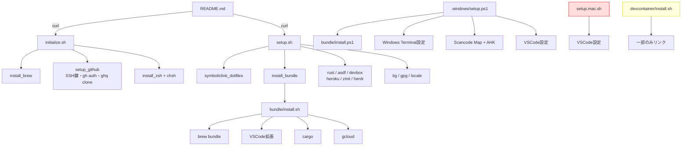
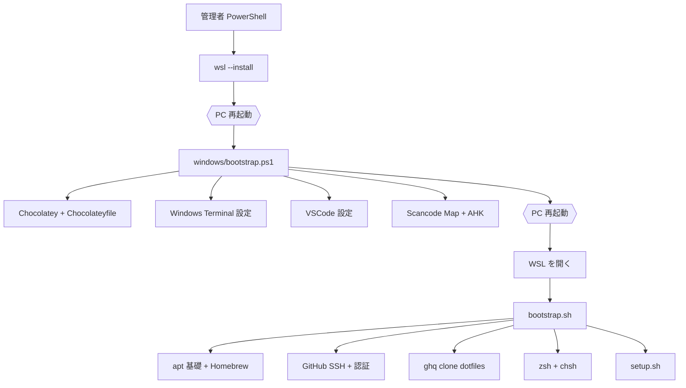
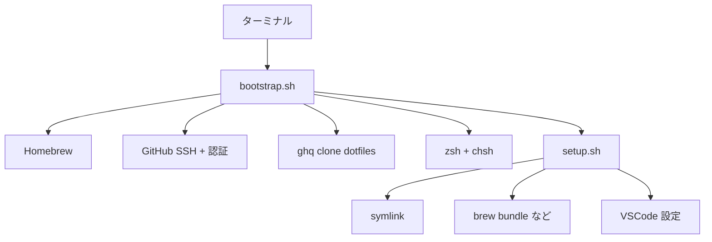

# セットアップ設計

新規マシンの構築と、既存マシンの再適用をどう行うかの設計。

## 現状

### スクリプトの呼び出し関係



赤は**どこからも呼ばれない**スクリプト。黄は devcontainer 機能から独立して呼ばれるもの。

### 入口が 7 つある

| スクリプト | 対象 | 呼び出し元 |
|---|---|---|
| `initialize.sh` | WSL / Mac | README（手動） |
| `setup.sh` | WSL / Mac | README（手動） |
| `setup.mac.sh` | Mac | **なし** |
| `bundle/install.sh` | WSL / Mac | `setup.sh` |
| `bundle/install.ps1` | Windows | `.windows/setup.ps1` |
| `.windows/setup.ps1` | Windows | `.windows/README.md`（手動） |
| `devcontainer/install.sh` | devcontainer | devcontainer 機能 |

どれをどの順で実行するかを示した文書が存在せず、`README.md` は 2 行の curl コマンドのみ。

## 検証済みの不具合

| # | 箇所 | 内容 |
|---|---|---|
| 1 | `bundle/install.sh:48` | `install_gcloud` の `exec $SHELL -l` がプロセスを置換し、**実行がそこで止まる** |
| 2 | `setup.sh:127` | `git clone ~/.asdf` が再実行で失敗、`set -e` で全体停止 |
| 3 | `setup.sh:247` | `setup_for_myself` の `&&` が非 0 を返し、`set -e` で停止 |
| 4 | `setup.sh:146` | バッククォートがパスをコマンドとして実行する |
| 5 | `setup.sh:212` | `setup_tig` の `ln -s` に `-f` が無く再実行で失敗 |
| 6 | `setup.sh:189` | `install_zinit` が bash から `source ~/.zshrc`（zsh 構文） |
| 7 | `setup.sh:219` | `vimplug_setup` が定義のみで未呼び出し。**nvim が新規マシンで壊れる** |
| 8 | `initialize.sh:74` | `sudo chsh -s` にユーザー指定が無く、**root のログインシェルを変更**している |
| 9 | `bundle/install.ps1:7` | `$line`（未定義）を参照。ループ変数は `$pkg` なので **choco が何もインストールしない** |
| 10 | `README.md` | `curl setup.sh \| bash` は `BASH_SOURCE` が空になり、カレントディレクトリ依存でしか動かない |
| 11 | `bundle/Npmfile` | どこからも参照されていない |
| 12 | `initialize.sh:68` | `ZSH_PATH` が `/usr/local/bin/zsh` 固定。**Apple Silicon では存在しない**パス |
| 13 | `initialize.sh:70` | `sudo sh -c "$(echo $ZSH_PATH)" >> /etc/shells` がパスをコマンドとして実行し、かつリダイレクトが sudo の外側で権限不足 |
| 14 | `dotfiles/.gitconfig:106` | `helper = osxkeychain` に OS 条件が無く、**Linux にも適用**される |

1 と 2 が「一発で完了しない」直接の原因。手動でのつまみ食い運用は、この 2 つへの回避策として発生していた。

12 と 13 は Mac 側でしか起きず、12 は `gpg-agent.conf.mac` が `/opt/homebrew` を前提にしているのと矛盾する。

## OS 固有のものの置き場所

Windows だけがディレクトリごと分かれているのは、**PowerShell という別のツールチェーンが必要**なため。Mac は同じ Unix / bash なので、スクリプト内の `$OSTYPE` 分岐で足りる。この非対称は妥当。

ただし Mac 固有は散在しており、検証されないまま不具合 12〜14 が残っていた。集約はしないが、パスの解決方法を統一する。

| Mac 固有 | 場所 | 対応 |
|---|---|---|
| VSCode 設定 | `setup.mac.sh` | `setup.sh` に統合し 3 OS 対応にする |
| パッケージ一覧 | `Brewfile.mac` | `Brewfile.darwin` に改名 |
| pinentry | `gpg-agent.conf.mac` | 現状維持 |
| Android SDK / JDK / ssh-add | `.zshrc` の分岐 | 現状維持 |
| tig の diff-highlight | `setup.sh` の分岐 | 現状維持 |
| Homebrew のパス | `initialize.sh` に直書き | `$(brew --prefix)` で解決し Intel / Apple Silicon 両対応 |
| `osxkeychain` | `.gitconfig` | `includeIf` などで OS 条件付きにする |

## 設計方針

### 1. 人間の介在が必要な地点だけを段階の境界にする

境界は 3 つだけ。それ以外は自動で連続実行する。

| 境界 | 理由 |
|---|---|
| Windows 再起動 | `wsl --install` の反映 |
| Windows 再起動 | Scancode Map はドライバ層のため |
| ブラウザ認証 | `gh auth login --web` |

**WSL 内に再起動は不要**。`chsh` はログインシェルの変更だが、`exec $SHELL -l` が再ログイン相当の役割を果たす。

### 2. 全処理を冪等にする

「済んでいれば飛ばす」ガードを付ける。全部流しても導入済みの環境では数秒で終わるため、コメントアウトによる選別が不要になる。

### 3. 選択実行を用意する

```
./setup.sh              # 全部
./setup.sh gpg herdr    # 指定したものだけ
./setup.sh --list       # 対象一覧
```

### 4. スクリプトは薄く、パッケージ一覧はデータに寄せる

`Brewfile` `Cargofile` `Chocolateyfile` `Vsplug` は宣言的なリスト。スクリプトはそれを読んで流すだけにする。

### 5. `exec` を実行の途中に置かない

プロセスが置換されて以降が実行されないため。シェルの再読み込みが必要な場合は、最後にメッセージで指示する。

## 実行順序

### Windows



### Mac



Mac に再起動の境界は無い。

## ディレクトリ構造

```
dotfiles/
├── README.md              入口。OS ごとの手順のみを書く
├── bootstrap.sh           1回きり。リポジトリが無い状態から始める
├── setup.sh               何度でも。冪等・選択実行
├── docs/
│   └── setup-design.md    このファイル
├── home/                  ~ へリンクされるもの（旧 dotfiles/）
├── packages/              パッケージ一覧のデータ（旧 bundle/）
│   ├── Brewfile.darwin
│   ├── Brewfile.linux     旧 Brewfile.win（中身は linuxbrew 用）
│   ├── Chocolateyfile
│   ├── Cargofile
│   ├── Vsplug
│   └── README.md          自動化できないもの（Chrome 拡張など）
├── windows/               Windows 専用（旧 .windows/）
│   ├── README.md
│   ├── bootstrap.ps1      旧 setup.ps1。choco も統合
│   └── keyboard/
├── vscode/                旧 .vscode/
└── devcontainer/
```

### 変更の意図

| 変更 | 理由 |
|---|---|
| `initialize.sh` → `bootstrap.sh` | 「初期化」より役割が明確 |
| `dotfiles/` → `home/` | リポジトリ名と重複していた。`$HOME` に置かれるものだと分かる |
| `bundle/` → `packages/` | 中身はパッケージ一覧。`bundle` は Ruby の Bundler と紛らわしい |
| `Brewfile.win` → `Brewfile.linux` | 中身は linuxbrew 用。Windows 用ではない |
| `.windows/` → `windows/` | 隠しディレクトリにする理由が無い |
| `bundle/install.ps1` を `windows/bootstrap.ps1` に統合 | Chocolatey は Windows 専用。分ける必要が無い |
| `setup.mac.sh` を `setup.sh` に統合 | 呼ばれていなかった。VSCode 設定が Linux で配置されない穴も埋まる |
| `bundle/install.sh` を `setup.sh` に統合 | 途中の `exec` が問題を起こしていた。分けている必然性が無い |

スクリプトは **7 つから 3 つ**（`bootstrap.sh` / `setup.sh` / `windows/bootstrap.ps1`）に減る。`devcontainer/install.sh` は用途が独立しているため残す。

## 移行の段階

破壊的変更を一度に行わず、動作を確認しながら進める。

| 段階 | 内容 | リスク |
|---|---|---|
| 1 | 検証済みの不具合 11 件を修正 | 低。今の構造のまま直す |
| 2 | `setup.sh` の冪等化と選択実行 | 低。実行して確認できる |
| 3 | `bundle/install.sh` と `setup.mac.sh` を `setup.sh` へ統合 | 中 |
| 4 | ディレクトリ名の変更 | 中。symlink の張り直しが必要 |
| 5 | `README.md` の書き直し | 低 |

段階 4 だけは既存マシンの symlink を張り直す必要があるため、他と分ける。

## 検証方法

新規マシンを用意せずに確認する手段。

- `setup.sh` の各処理を 2 回連続で実行し、2 回目が数秒で終わることを確認する
- `bash -n` と `shellcheck` を通す
- 使い捨てのコンテナで `bootstrap.sh` を流す（GitHub 認証は対話が必要なため部分的）
