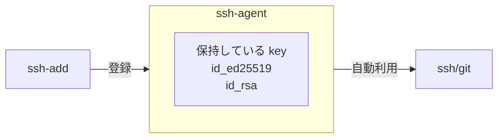
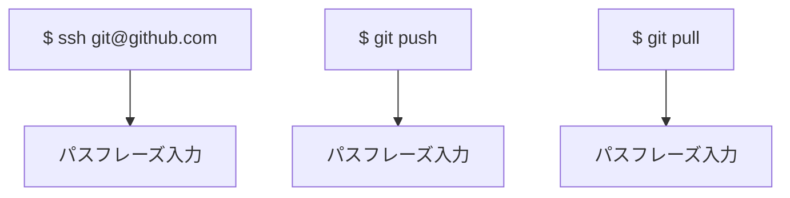
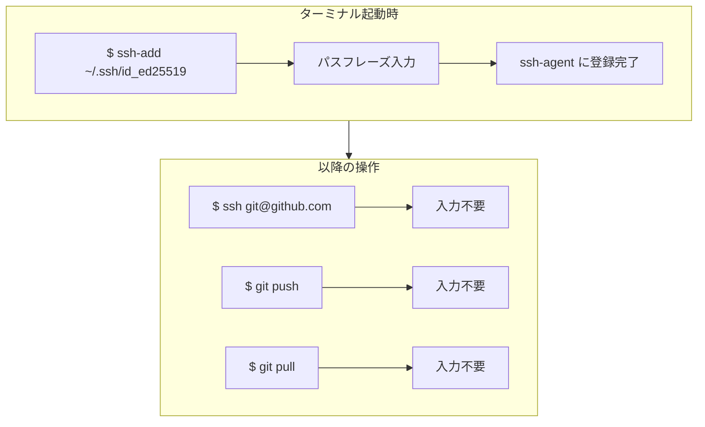
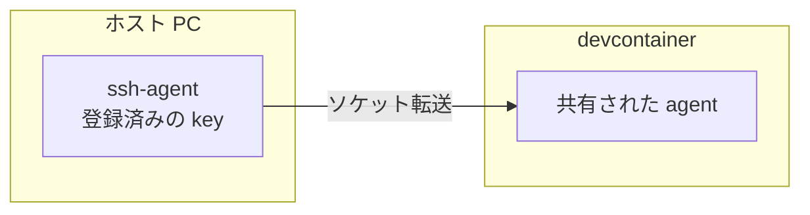
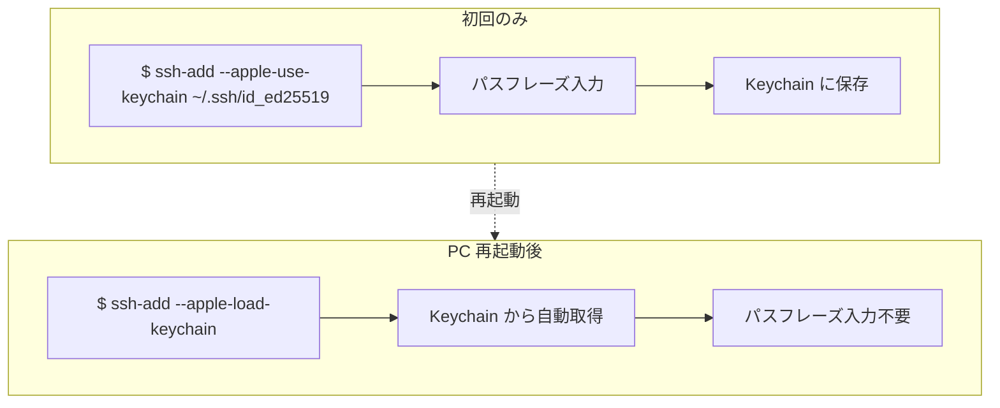
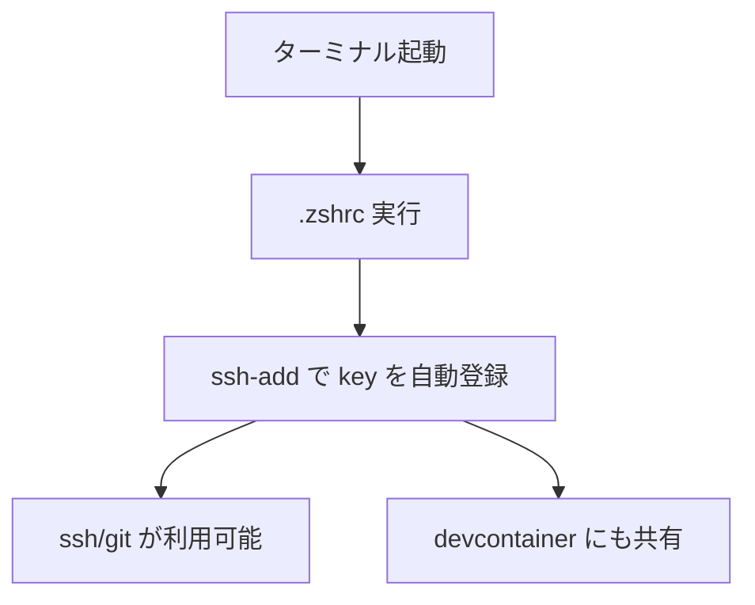

# SSH Agent

## 概要

- **ssh-agent**: 復号済みの秘密鍵をメモリ上に保持する常駐サービス
- **ssh-add**: ssh-agent に key を登録するコマンド
- **メリット**: パスフレーズ入力が 1 日 1 回で済む、devcontainer にも key が共有される

---

## ssh-agent とは

秘密鍵をメモリ上に保持する常駐サービス。一度登録すると、ssh や git が自動的に利用する。

---

## ssh-agent 未使用時

毎回パスフレーズの入力が必要になる。

1 日に何十回も入力が発生する。

---

## ssh-agent 使用時

ターミナル起動時の 1 回のみで完了する。

---

## 主要コマンド

| コマンド      | 説明                             |
| ------------- | -------------------------------- |
| `ssh-add key` | key を agent に登録              |
| `ssh-add -l`  | 登録済みの key を一覧表示        |
| `ssh-add -D`  | 登録済みの key をすべて削除      |
| `ssh-agent`   | サービス起動（macOS は自動起動） |

---

## devcontainer との連携

devcontainer を起動すると、ホストの ssh-agent が自動的に共有される。

**ポイント:**

- コンテナ内に key ファイルをコピーする必要がない（セキュリティ面で有利）
- ホストで `ssh-add` しておけば、コンテナ内でも git 操作が可能

これは devcontainer の仕様であり、VSCode Dev Containers 拡張機能が自動的に設定する。

**参考**: [Sharing Git credentials with your container](https://code.visualstudio.com/remote/advancedcontainers/sharing-git-credentials)

> The extension will automatically forward your local SSH agent if one is running.

---

## macOS の Keychain 連携

### Keychain とは

macOS のパスワード管理システム。SSH key のパスフレーズを保存できる。

### 使用方法

### オプション

| オプション              | 説明                                   |
| ----------------------- | -------------------------------------- |
| `--apple-use-keychain`  | 登録時にパスフレーズを Keychain に保存 |
| `--apple-load-keychain` | Keychain から保存済みの key を読み込み |

### パスフレーズ未設定の key の場合

Keychain 連携は不要。通常の `ssh-add key` で登録するのみ。

---

## .zshrc での自動化

ターミナル起動時に自動で key を登録する設定を記述している。

### macOS

1. Keychain から key をロード（パスフレーズ設定済みの場合）
2. ロードされていなければ明示的に追加（パスフレーズ未設定の場合）

### WSL2/Linux

1. ssh-agent が起動していなければ起動
2. key がロードされていなければ追加

---

<!-- AI Agent Context (この部分は人間向けではなく、将来このドキュメントを見直すAI向けのメモです)

## 作成経緯
- 2026-01-22 に作成
- ユーザーの .zshrc に SSH Agent 設定を追加する過程で、ssh-agent/ssh-add の仕組みを説明
- ユーザーとの対話を通じて理解を深めながら、最終的にドキュメント化

## 参照した資料
- VSCode公式ドキュメント: https://code.visualstudio.com/remote/advancedcontainers/sharing-git-credentials
  - "The extension will automatically forward your local SSH agent if one is running." という記述を確認
- macOS の ssh-add オプション: `--apple-use-keychain`, `--apple-load-keychain` は macOS 固有

## ユーザーとの会話で確認した事項
1. ssh-agent はメモリ上で動作する常駐サービスで、PC再起動で消える
2. ssh-add は agent に key を登録するコマンド
3. devcontainer への agent 転送は VSCode Dev Containers 拡張機能の仕様
4. macOS の Keychain はパスフレーズを保存する仕組み（パスフレーズ未設定の key には不要）
5. `AddKeysToAgent yes` は SSH 接続時に agent に追加する設定（起動時ではない）
6. パスフレーズ未設定の key は Keychain 連携不要だが、.zshrc で明示的に ssh-add する必要がある

## .zshrc の実装について
- macOS: `ssh-add --apple-load-keychain` + パスフレーズなしの key 用に明示的な ssh-add
- WSL2/Linux: ssh-agent 起動確認 + ssh-add
- 対象 key: id_ed25519, id_rsa

## 表現に関する判断
- 「鍵」→「key」に統一（ユーザーの希望）
- 「秘密鍵」はそのまま維持（「秘密 key」は不自然、「private key」は英語寄りすぎ）
- カジュアルな表現（「預ける」「金庫」等）は技術ドキュメントとして適切な表現に修正

## 注意点
- devcontainer 起動前に ssh-agent に key が登録されている必要がある
- `AddKeysToAgent yes` だけでは devcontainer 起動時に agent が空の可能性がある
-->
